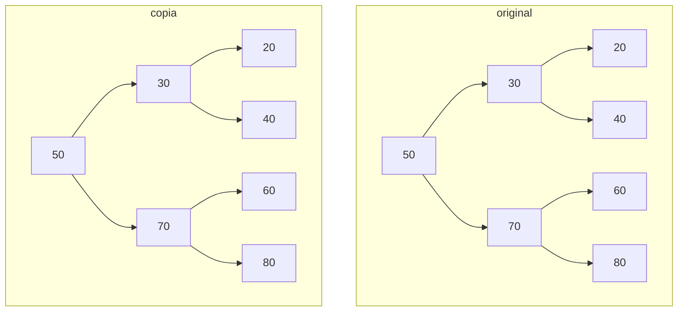
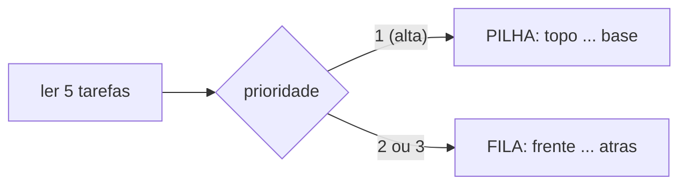
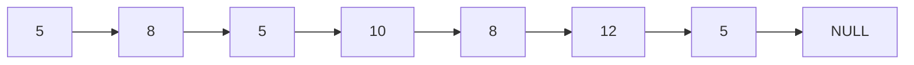
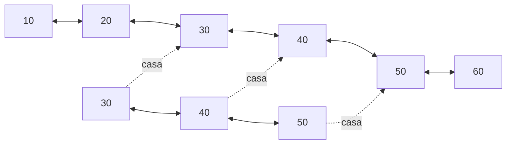
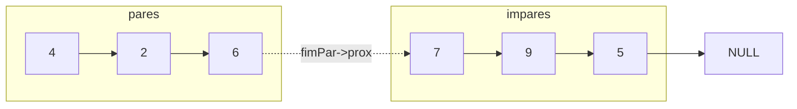
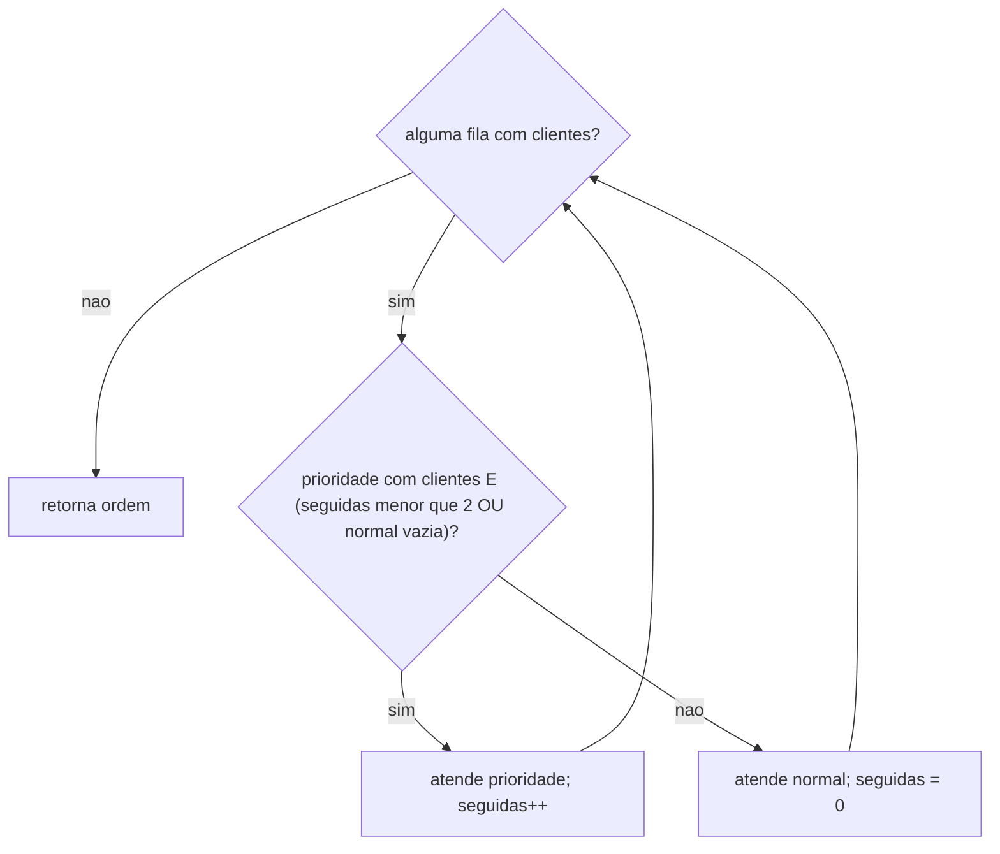
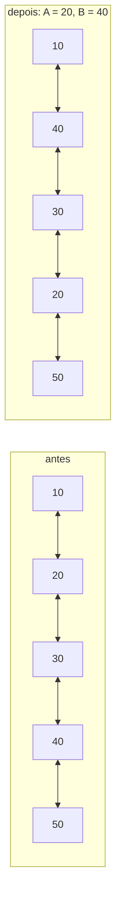

# Listas, Pilhas, Filas e Árvores - Respostas

Padrões seguidos (`cesar/refs`): `typedef struct No`, `new`/`delete` (com o equivalente `malloc`/`free` comentado), `Fila` com `frente`/`atras`, `inserirFim`, `imprimirLista`. Apenas `<iostream>`, `<stdlib.h>` e `<string.h>`.

---

## Q1 - Sistema de Atendimento (Fila + Lista)

> Clientes entram em uma **Fila** (Inserir). Ao serem atendidos, saem da Fila (Remover) e entram em uma **Lista de histórico** (Inserir).


```cpp
#include <iostream>
#include <stdlib.h>
#include <string.h>

using namespace std;

typedef struct No {
    char nome[50];
    struct No* prox;
} No;

typedef struct {
    No* frente;
    No* atras;
} Fila;

Fila* criarFila() {
    Fila* f = new Fila; // Fila* f = (Fila*)malloc(sizeof(Fila));
    f->frente = f->atras = NULL;
    return f;
}

// FILA: cliente entra no fim (Inserir)
void enfileirar(Fila* f, const char nome[]) {
    No* novo = new No; // No* novo = (No*)malloc(sizeof(No));
    strcpy(novo->nome, nome);
    novo->prox = NULL;
    if (!f->atras) {
        f->frente = f->atras = novo;
        return;
    }
    f->atras->prox = novo;
    f->atras = novo;
}

// FILA: cliente sai do início (Remover)
int desenfileirar(Fila* f, char nome[]) {
    if (!f->frente)
        return 0;
    No* temp = f->frente;
    strcpy(nome, temp->nome);
    f->frente = f->frente->prox;
    if (!f->frente)
        f->atras = NULL;
    delete temp; // free(temp);
    return 1;
}

// LISTA: cliente entra no fim do histórico (Inserir)
No* inserirFim(No* lista, const char nome[]) {
    No* novo = new No; // No* novo = (No*)malloc(sizeof(No));
    strcpy(novo->nome, nome);
    novo->prox = NULL;
    if (!lista)
        return novo;

    No* temp = lista;
    while (temp->prox)
        temp = temp->prox;
    temp->prox = novo;
    return lista;
}

// Sai da Fila e entra na Lista de histórico
No* atender(Fila* f, No* historico) {
    char nome[50];
    if (!desenfileirar(f, nome)) {
        cout << "Fila vazia\n";
        return historico;
    }
    cout << "Atendido: " << nome << "\n";
    return inserirFim(historico, nome);
}

void imprimirFila(Fila* f) {
    No* temp = f->frente;
    while (temp) {
        cout << temp->nome << " <- ";
        temp = temp->prox;
    }
    cout << "NULL \n";
}

void imprimirLista(No* lista) {
    No* temp = lista;
    while (temp) {
        cout << temp->nome << " -> ";
        temp = temp->prox;
    }
    cout << "NULL \n";
}

int main() {
    Fila* fila = criarFila();
    No* historico = NULL;

    enfileirar(fila, "Ana");
    enfileirar(fila, "Bruno");
    enfileirar(fila, "Carlos");
    cout << "Fila: ";
    imprimirFila(fila);

    historico = atender(fila, historico);
    historico = atender(fila, historico);

    cout << "Fila: ";
    imprimirFila(fila);
    cout << "Historico: ";
    imprimirLista(historico);

    return 0;
}
```

```
Fila: Ana <- Bruno <- Carlos <- NULL 
Atendido: Ana
Atendido: Bruno
Fila: Carlos <- NULL 
Historico: Ana -> Bruno -> NULL 
```

---

## Q2 - Cópia de árvore binária

> Crie a árvore. Crie o procedimento/função que irá copiar a árvore existente.

Cópia em **pré-ordem**: cria o nó e depois copia a esquerda e a direita. Os nós são **novos**, então alterar a cópia não afeta a original.



```cpp
#include <iostream>
#include <stdlib.h>

using namespace std;

struct No {
    int valor;
    struct No* esquerda;
    struct No* direita;
};

No* novoNo(int valor) {
    No* novo = new No; // No* novo = (No*)malloc(sizeof(No));
    novo->valor = valor;
    novo->esquerda = NULL;
    novo->direita = NULL;
    return novo;
}

// Cria a árvore (inserção em árvore binária de busca)
No* inserir(No* raiz, int valor) {
    if (raiz == NULL)
        return novoNo(valor);
    if (valor < raiz->valor)
        raiz->esquerda = inserir(raiz->esquerda, valor);
    else if (valor > raiz->valor)
        raiz->direita = inserir(raiz->direita, valor);
    return raiz;
}

// Copia a árvore: cria o nó (raiz) e depois copia esquerda e direita
No* copiar(No* raiz) {
    if (raiz == NULL)
        return NULL;
    No* copia = novoNo(raiz->valor);
    copia->esquerda = copiar(raiz->esquerda);
    copia->direita = copiar(raiz->direita);
    return copia;
}

void emOrdem(No* raiz) {
    if (raiz != NULL) {
        emOrdem(raiz->esquerda);
        cout << raiz->valor << " ";
        emOrdem(raiz->direita);
    }
}

int main() {
    No* raiz = NULL;
    int valores[] = {50, 30, 70, 20, 40, 60, 80};
    for (int i = 0; i < 7; i++)
        raiz = inserir(raiz, valores[i]);

    No* copia = copiar(raiz);

    cout << "Original: ";
    emOrdem(raiz);
    cout << "\nCopia:    ";
    emOrdem(copia);

    // Altera a cópia: a original não pode mudar
    copia = inserir(copia, 90);
    cout << "\n\nInserindo 90 na copia...\n";
    cout << "Original: ";
    emOrdem(raiz);
    cout << "\nCopia:    ";
    emOrdem(copia);
    cout << "\n";

    return 0;
}
```

```
Original: 20 30 40 50 60 70 80 
Copia:    20 30 40 50 60 70 80 

Inserindo 90 na copia...
Original: 20 30 40 50 60 70 80 
Copia:    20 30 40 50 60 70 80 90 
```

---

## Q3 - Pilha, Fila e Struct

> a) Implemente uma pilha de tarefas. b) Implemente também uma fila de tarefas. c) Leia 5 tarefas: prioridade alta (1) na pilha; média ou baixa (2 ou 3) na fila. Mostre ao final as tarefas da pilha e as da fila.



```cpp
#include <iostream>
#include <stdlib.h>
#include <string.h>

using namespace std;

typedef struct {
    int id;
    char descricao[50];
    int prioridade; // 1 = alta, 2 = média, 3 = baixa
} Tarefa;

typedef struct No {
    Tarefa dado;
    struct No* prox;
} No;

// a) PILHA de tarefas: insere e remove no topo
No* empilhar(No* topo, Tarefa t) {
    No* novo = new No; // No* novo = (No*)malloc(sizeof(No));
    novo->dado = t;
    novo->prox = topo;
    return novo;
}

No* desempilhar(No* topo, Tarefa* t) {
    if (!topo)
        return NULL;
    No* temp = topo;
    *t = topo->dado;
    topo = topo->prox;
    delete temp; // free(temp);
    return topo;
}

// b) FILA de tarefas: insere atrás, remove na frente
typedef struct {
    No* frente;
    No* atras;
} Fila;

Fila* criarFila() {
    Fila* f = new Fila; // Fila* f = (Fila*)malloc(sizeof(Fila));
    f->frente = f->atras = NULL;
    return f;
}

void enfileirar(Fila* f, Tarefa t) {
    No* novo = new No; // No* novo = (No*)malloc(sizeof(No));
    novo->dado = t;
    novo->prox = NULL;
    if (!f->atras) {
        f->frente = f->atras = novo;
        return;
    }
    f->atras->prox = novo;
    f->atras = novo;
}

void desenfileirar(Fila* f) {
    if (!f->frente)
        return;
    No* temp = f->frente;
    f->frente = f->frente->prox;
    if (!f->frente)
        f->atras = NULL;
    delete temp; // free(temp);
}

void exibirTarefa(Tarefa t) {
    cout << "ID: " << t.id << " | Descricao: " << t.descricao
         << " | Prioridade: " << t.prioridade << "\n";
}

void exibirPilha(No* topo) {
    cout << "\nTarefas na PILHA:\n";
    if (!topo)
        cout << "Pilha vazia\n";
    No* temp = topo;
    while (temp) {
        exibirTarefa(temp->dado);
        temp = temp->prox;
    }
}

void exibirFila(Fila* f) {
    cout << "\nTarefas na FILA:\n";
    if (!f->frente)
        cout << "Fila vazia\n";
    No* temp = f->frente;
    while (temp) {
        exibirTarefa(temp->dado);
        temp = temp->prox;
    }
}

// c) Lê 5 tarefas: prioridade 1 na pilha; 2 ou 3 na fila
int main() {
    No* pilha = NULL;
    Fila* fila = criarFila();
    Tarefa t;

    for (int i = 0; i < 5; i++) {
        cout << "\nTarefa " << i + 1 << "\n";
        cout << "ID: ";
        cin >> t.id;
        cin.ignore(); // Descarta o ENTER antes de ler a descrição
        cout << "Descricao: ";
        cin.getline(t.descricao, 50);
        cout << "Prioridade (1 = alta, 2 = media, 3 = baixa): ";
        cin >> t.prioridade;
        while (t.prioridade < 1 || t.prioridade > 3) {
            cout << "Prioridade invalida. Digite 1, 2 ou 3: ";
            cin >> t.prioridade;
        }

        if (t.prioridade == 1)
            pilha = empilhar(pilha, t);
        else
            enfileirar(fila, t);
    }

    exibirPilha(pilha);
    exibirFila(fila);

    return 0;
}
```

Entrada e saída (valores digitados após cada `:`):

```
Tarefa 1
ID: 1
Descricao: Corrigir bug no login
Prioridade (1 = alta, 2 = media, 3 = baixa): 1

Tarefa 2
ID: 2
Descricao: Escrever relatorio
Prioridade (1 = alta, 2 = media, 3 = baixa): 2

Tarefa 3
ID: 3
Descricao: Deploy urgente
Prioridade (1 = alta, 2 = media, 3 = baixa): 1

Tarefa 4
ID: 4
Descricao: Organizar mesa
Prioridade (1 = alta, 2 = media, 3 = baixa): 3

Tarefa 5
ID: 5
Descricao: Reuniao semanal
Prioridade (1 = alta, 2 = media, 3 = baixa): 2

Tarefas na PILHA:
ID: 3 | Descricao: Deploy urgente | Prioridade: 1
ID: 1 | Descricao: Corrigir bug no login | Prioridade: 1

Tarefas na FILA:
ID: 2 | Descricao: Escrever relatorio | Prioridade: 2
ID: 4 | Descricao: Organizar mesa | Prioridade: 3
ID: 5 | Descricao: Reuniao semanal | Prioridade: 2
```

A pilha mostra na ordem **inversa** da inserção (LIFO); a fila, na **mesma** ordem (FIFO).

---

## Q4 - Lista Encadeada (contar valores)

> a) Função para inserir no final. b) Função que receba um número informado pelo usuário e conte quantos valores iguais existem na lista; retorne a quantidade e informe na tela. c) Teste com: 5, 8, 5, 10, 8, 12, 5.



```cpp
#include <iostream>
#include <stdlib.h>

using namespace std;

typedef struct No {
    int dado;
    struct No* prox;
} No;

// a) Inserir no final da lista
No* inserirFim(No* lista, int valor) {
    No* novo = new No; // No* novo = (No*)malloc(sizeof(No));
    novo->dado = valor;
    novo->prox = NULL;
    if (!lista)
        return novo;

    No* temp = lista;
    while (temp->prox)
        temp = temp->prox;
    temp->prox = novo;
    return lista;
}

// b) Conta quantos valores iguais ao informado existem na lista
int contar_valores(No* lista, int valor) {
    int quantidade = 0;
    No* temp = lista;
    while (temp) {
        if (temp->dado == valor)
            quantidade++;
        temp = temp->prox;
    }
    return quantidade;
}

void imprimirLista(No* lista) {
    No* temp = lista;
    while (temp) {
        cout << temp->dado << " -> ";
        temp = temp->prox;
    }
    cout << "NULL \n";
}

int main() {
    No* lista = NULL;

    // c) Insere os valores de teste
    int valores[] = {5, 8, 5, 10, 8, 12, 5};
    for (int i = 0; i < 7; i++)
        lista = inserirFim(lista, valores[i]);

    // Mostra a lista após a inserção
    cout << "Lista: ";
    imprimirLista(lista);

    // Chama contar_valores
    int numero;
    cout << "Digite um numero: ";
    cin >> numero;
    int quantidade = contar_valores(lista, numero);
    cout << "O numero " << numero << " aparece " << quantidade << " vez(es) na lista.\n";

    return 0;
}
```

Entrada: `5`.

```
Lista: 5 -> 8 -> 5 -> 10 -> 8 -> 12 -> 5 -> NULL 
Digite um numero: 5
O numero 5 aparece 3 vez(es) na lista.
```

---

## Q5 - Sequência contínua em listas duplamente encadeadas

> Dadas duas listas duplamente encadeadas, determine se a segunda aparece como uma sequência contínua dentro da primeira. A função não deve modificar nenhuma das listas.

Para cada nó de `A`, tenta casar `B` inteira a partir dali; se algum valor diferir, recomeça no **próximo** nó de `A`. Só ponteiros auxiliares (`inicio`, `a`, `b`) andam; nenhum `prox`/`ant` é alterado.



Tratamentos: `B` vazia (`true`); `A` vazia (`false`); `A` termina antes de `B` (`false`).

```cpp
#include <iostream>
#include <stdlib.h>

using namespace std;

typedef struct No {
    int dado;
    struct No* ant;
    struct No* prox;
} No;

No* inserirFim(No* lista, int valor) {
    No* novo = new No; // No* novo = (No*)malloc(sizeof(No));
    novo->dado = valor;
    novo->ant = NULL;
    novo->prox = NULL;
    if (!lista)
        return novo;

    No* temp = lista;
    while (temp->prox)
        temp = temp->prox;
    temp->prox = novo;
    novo->ant = temp;
    return lista;
}

// B aparece como sequência contínua dentro de A?
// Usa apenas ponteiros auxiliares: nenhuma lista é modificada.
bool contemSequencia(No* A, No* B) {
    if (!B)
        return true; // Lista vazia está contida em qualquer lista

    No* inicio = A;
    while (inicio) {
        No* a = inicio;
        No* b = B;
        while (a && b && a->dado == b->dado) {
            a = a->prox;
            b = b->prox;
        }
        if (!b)
            return true;  // Percorreu B inteira
        if (!a)
            return false; // A acabou antes de B: não cabe mais
        inicio = inicio->prox; // Recomeça no próximo nó de A
    }
    return false;
}

void imprimirLista(No* lista) {
    No* temp = lista;
    while (temp) {
        cout << temp->dado;
        if (temp->prox)
            cout << " ↔ ";
        temp = temp->prox;
    }
    cout << "\n";
}

int main() {
    No* A = NULL;
    No* B = NULL;
    No* C = NULL;

    int valoresA[] = {10, 20, 30, 40, 50, 60};
    int valoresB[] = {30, 40, 50};
    int valoresC[] = {30, 50};
    for (int i = 0; i < 6; i++)
        A = inserirFim(A, valoresA[i]);
    for (int i = 0; i < 3; i++)
        B = inserirFim(B, valoresB[i]);
    for (int i = 0; i < 2; i++)
        C = inserirFim(C, valoresC[i]);

    cout << "Lista A:\n";
    imprimirLista(A);
    cout << "\nLista B:\n";
    imprimirLista(B);
    cout << "\nResultado: " << (contemSequencia(A, B) ? "true" : "false") << "\n";

    cout << "\nPara:\n";
    imprimirLista(C);
    cout << "\nResultado: " << (contemSequencia(A, C) ? "true" : "false") << "\n";

    return 0;
}
```

```
Lista A:
10 ↔ 20 ↔ 30 ↔ 40 ↔ 50 ↔ 60

Lista B:
30 ↔ 40 ↔ 50

Resultado: true

Para:
30 ↔ 50

Resultado: false
```

---

## Q6 - Pares antes dos ímpares

> Reorganize os próprios nós de uma lista simplesmente encadeada para que os pares apareçam antes dos ímpares, preservando a ordem relativa.

Uma passada: cada nó é pendurado no fim da sublista de **pares** ou de **ímpares**; no final, `fimPar->prox = iniImpar`. Nenhum nó é criado nem tem o valor alterado.



Tratamentos: lista vazia; só ímpares (`iniPar` é `NULL`); só pares. `dado % 2 == 0` também funciona com negativos (`-4 % 2 == 0`).

```cpp
#include <iostream>
#include <stdlib.h>

using namespace std;

typedef struct No {
    int dado;
    struct No* prox;
} No;

No* inserirFim(No* lista, int valor) {
    No* novo = new No; // No* novo = (No*)malloc(sizeof(No));
    novo->dado = valor;
    novo->prox = NULL;
    if (!lista)
        return novo;

    No* temp = lista;
    while (temp->prox)
        temp = temp->prox;
    temp->prox = novo;
    return lista;
}

// Reorganiza os próprios nós: pares antes dos ímpares, mantendo a ordem relativa.
No* paresAntesImpares(No* lista) {
    No* iniPar = NULL;
    No* fimPar = NULL;
    No* iniImpar = NULL;
    No* fimImpar = NULL;

    No* atual = lista;
    while (atual) {
        No* proximo = atual->prox;
        atual->prox = NULL; // Desliga o nó antes de pendurá-lo

        if (atual->dado % 2 == 0) { // Par (também vale para negativos)
            if (!iniPar)
                iniPar = atual;
            else
                fimPar->prox = atual;
            fimPar = atual;
        } else {
            if (!iniImpar)
                iniImpar = atual;
            else
                fimImpar->prox = atual;
            fimImpar = atual;
        }
        atual = proximo;
    }

    if (!iniPar)
        return iniImpar; // Não há pares (ou lista vazia)
    fimPar->prox = iniImpar; // Liga o fim dos pares ao início dos ímpares
    return iniPar;
}

void imprimirLista(No* lista) {
    No* temp = lista;
    while (temp) {
        cout << temp->dado;
        if (temp->prox)
            cout << " → ";
        temp = temp->prox;
    }
    cout << "\n";
}

int main() {
    No* lista = NULL;
    int valores[] = {7, 4, 9, 2, 6, 5};
    for (int i = 0; i < 6; i++)
        lista = inserirFim(lista, valores[i]);

    cout << "Exemplo:\n";
    imprimirLista(lista);

    lista = paresAntesImpares(lista);

    cout << "\nResultado:\n";
    imprimirLista(lista);

    return 0;
}
```

```
Exemplo:
7 → 4 → 9 → 2 → 6 → 5

Resultado:
4 → 2 → 6 → 7 → 9 → 5
```

---

## Q7 - Duas filas: 2 prioridades para 1 normal

> A cada 2 prioridades, uma normal deve ser atendida. Se uma das filas ficar vazia, os clientes da outra continuam sendo atendidos. Produza uma terceira fila com a ordem completa de atendimento.

`seguidas` conta as prioridades atendidas desde a última normal. Atende prioridade enquanto `seguidas < 2` (ou se a normal estiver vazia); senão atende uma normal e zera o contador.



```cpp
#include <iostream>
#include <stdlib.h>
#include <string.h>

using namespace std;

typedef struct No {
    char nome[50];
    struct No* prox;
} No;

typedef struct {
    No* frente;
    No* atras;
} Fila;

Fila* criarFila() {
    Fila* f = new Fila; // Fila* f = (Fila*)malloc(sizeof(Fila));
    f->frente = f->atras = NULL;
    return f;
}

void enfileirar(Fila* f, const char nome[]) {
    No* novo = new No; // No* novo = (No*)malloc(sizeof(No));
    strcpy(novo->nome, nome);
    novo->prox = NULL;
    if (!f->atras) {
        f->frente = f->atras = novo;
        return;
    }
    f->atras->prox = novo;
    f->atras = novo;
}

void desenfileirar(Fila* f, char nome[]) {
    if (!f->frente)
        return;
    No* temp = f->frente;
    strcpy(nome, temp->nome);
    f->frente = f->frente->prox;
    if (!f->frente)
        f->atras = NULL;
    delete temp; // free(temp);
}

// Retira o primeiro de 'origem' e coloca no fim de 'destino'
void atender(Fila* origem, Fila* destino) {
    char nome[50];
    desenfileirar(origem, nome);
    enfileirar(destino, nome);
}

// A cada 2 prioridades, 1 normal. Se uma fila esvaziar, a outra continua.
Fila* ordemAtendimento(Fila* prioridade, Fila* normal) {
    Fila* ordem = criarFila();
    int seguidas = 0; // Prioridades atendidas desde a última normal

    while (prioridade->frente || normal->frente) {
        if (prioridade->frente && (seguidas < 2 || !normal->frente)) {
            atender(prioridade, ordem);
            seguidas++;
        } else {
            atender(normal, ordem);
            seguidas = 0;
        }
    }
    return ordem;
}

void imprimirFila(Fila* f) {
    No* temp = f->frente;
    while (temp) {
        cout << temp->nome;
        if (temp->prox)
            cout << ", ";
        temp = temp->prox;
    }
    cout << "\n";
}

int main() {
    Fila* prioridade = criarFila();
    Fila* normal = criarFila();

    enfileirar(prioridade, "P1");
    enfileirar(prioridade, "P2");
    enfileirar(prioridade, "P3");
    enfileirar(prioridade, "P4");
    enfileirar(prioridade, "P5");

    enfileirar(normal, "N1");
    enfileirar(normal, "N2");
    enfileirar(normal, "N3");
    enfileirar(normal, "N4");

    cout << "Prioridade: ";
    imprimirFila(prioridade);
    cout << "\nNormal: ";
    imprimirFila(normal);

    Fila* ordem = ordemAtendimento(prioridade, normal);

    cout << "\nOrdem de atendimento:\n\n";
    imprimirFila(ordem);

    return 0;
}
```

```
Prioridade: P1, P2, P3, P4, P5

Normal: N1, N2, N3, N4

Ordem de atendimento:

P1, P2, N1, P3, P4, N2, P5, N3, N4
```

---

## Q8 - Trocar dois nós em lista duplamente encadeada

> Receba uma lista duplamente encadeada e dois valores A e B; troque de posição os nós que possuem esses valores. Não é permitido simplesmente trocar os valores armazenados nos nós.

Os nós mudam de lugar religando `ant` e `prox`. `a` é o nó que aparece primeiro; `b`, o outro.

- **Distantes:** `antA ↔ a ↔ proxA ... antB ↔ b ↔ proxB` vira `antA ↔ b ↔ proxA ... antB ↔ a ↔ proxB`.
- **Vizinhos** (`a->prox == b`): `antA ↔ a ↔ b ↔ proxB` vira `antA ↔ b ↔ a ↔ proxB`. Usar a regra dos "distantes" aqui faria `a` apontar para si mesmo.
- **Início:** se `a` era o primeiro, `b` vira o início da lista (por isso a função retorna `No*`).
- `A == B` ou valor inexistente: lista inalterada.



```cpp
#include <iostream>
#include <stdlib.h>

using namespace std;

typedef struct No {
    int dado;
    struct No* ant;
    struct No* prox;
} No;

No* inserirFim(No* lista, int valor) {
    No* novo = new No; // No* novo = (No*)malloc(sizeof(No));
    novo->dado = valor;
    novo->ant = NULL;
    novo->prox = NULL;
    if (!lista)
        return novo;

    No* temp = lista;
    while (temp->prox)
        temp = temp->prox;
    temp->prox = novo;
    novo->ant = temp;
    return lista;
}

// Troca de posição os NÓS com valores A e B (os valores não são trocados).
// Retorna o início da lista, que muda se um dos nós era o primeiro.
No* trocarNos(No* lista, int A, int B) {
    if (A == B)
        return lista;

    // 'a' = nó que aparece primeiro; 'b' = o outro valor, mais adiante
    No* a = NULL;
    No* b = NULL;
    No* temp = lista;
    while (temp && !b) {
        if (!a && (temp->dado == A || temp->dado == B))
            a = temp;
        else if (a && temp->dado == (a->dado == A ? B : A))
            b = temp;
        temp = temp->prox;
    }
    if (!a || !b)
        return lista; // Algum dos valores não existe

    No* antA = a->ant;
    No* proxB = b->prox;

    if (a->prox == b) {
        // Vizinhos: antA ↔ a ↔ b ↔ proxB  =>  antA ↔ b ↔ a ↔ proxB
        b->ant = antA;
        b->prox = a;
        a->ant = b;
        a->prox = proxB;
    } else {
        // Distantes: antA ↔ a ↔ proxA ... antB ↔ b ↔ proxB
        No* proxA = a->prox;
        No* antB = b->ant;
        b->ant = antA;
        b->prox = proxA;
        a->ant = antB;
        a->prox = proxB;
        proxA->ant = b;
        antB->prox = a;
    }

    if (antA)
        antA->prox = b;
    else
        lista = b; // 'a' era o primeiro: 'b' vira o início
    if (proxB)
        proxB->ant = a;

    return lista;
}

void imprimirLista(No* lista) {
    No* temp = lista;
    while (temp) {
        cout << temp->dado;
        if (temp->prox)
            cout << " ↔ ";
        temp = temp->prox;
    }
    cout << "\n";
}

int main() {
    No* lista = NULL;
    int valores[] = {10, 20, 30, 40, 50};
    for (int i = 0; i < 5; i++)
        lista = inserirFim(lista, valores[i]);

    int A = 20, B = 40;

    cout << "Exemplo: ";
    imprimirLista(lista);
    cout << "\nPara A = " << A << " e B = " << B << ":\n\n";

    lista = trocarNos(lista, A, B);

    cout << "Resposta: ";
    imprimirLista(lista);

    return 0;
}
```

```
Exemplo: 10 ↔ 20 ↔ 30 ↔ 40 ↔ 50

Para A = 20 e B = 40:

Resposta: 10 ↔ 40 ↔ 30 ↔ 20 ↔ 50
```
