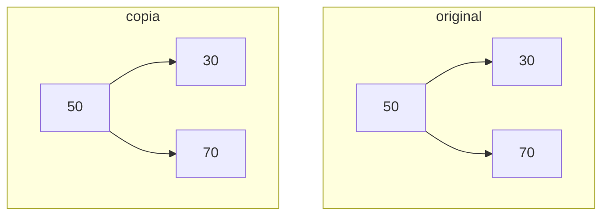
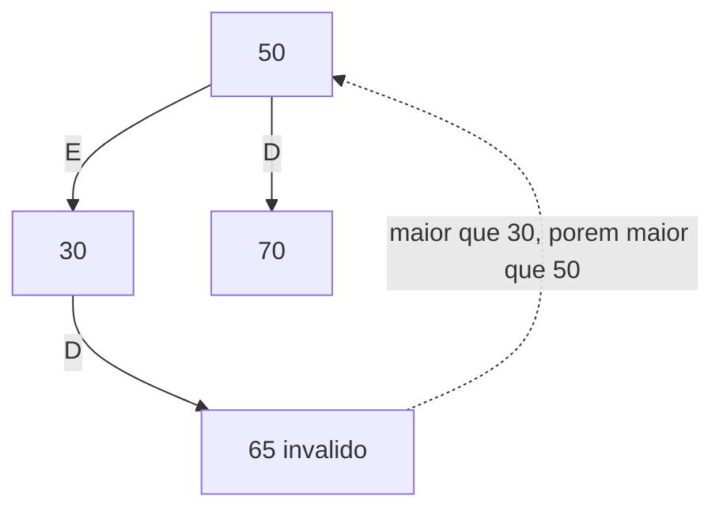
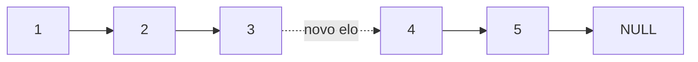
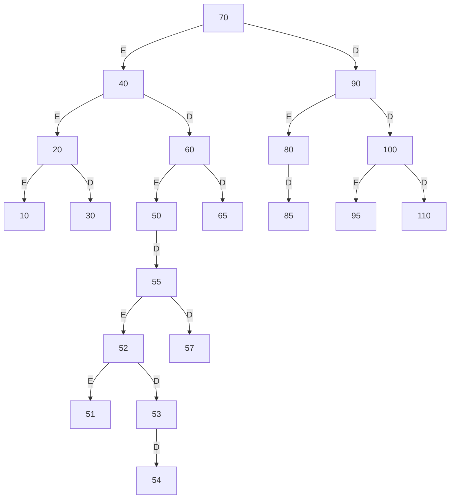
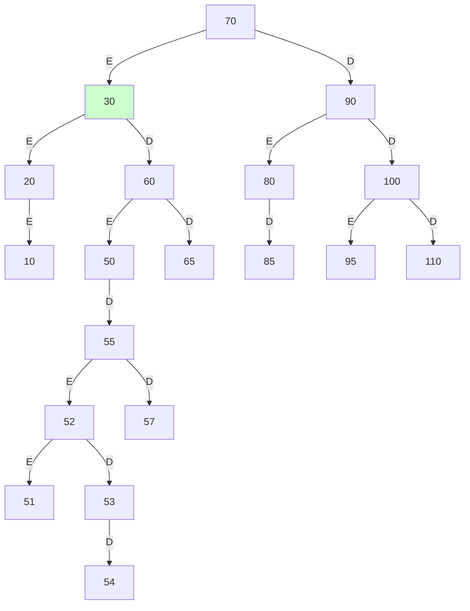
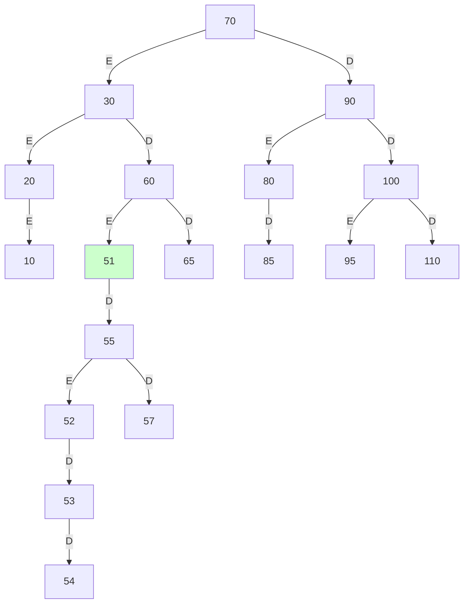

# AV1 - AED - Respostas

## Q1 - Fila + Lista de histórico (2.0)

Cliente entra na **Fila** (fim); ao ser atendido, sai da Fila (início) e entra na **Lista** de histórico (fim).


```cpp
#include <iostream>
using namespace std;

typedef struct No {
    int senha;
    struct No* prox;
} No;

// FILA: insere no fim.
No* enfileirar(No* fim, No* &ini, int senha) {
    No* novo = new No;
    novo->senha = senha;
    novo->prox = NULL;
    if (!ini) { ini = novo; return novo; }
    fim->prox = novo;
    return novo;
}

// FILA: remove do início.
No* desenfileirar(No* &ini, No* &fim) {
    if (!ini) return NULL;
    No* atendido = ini;
    ini = ini->prox;
    if (!ini) fim = NULL;
    atendido->prox = NULL;
    return atendido;
}

// LISTA: insere no fim do histórico.
No* inserirHistorico(No* lista, int senha) {
    No* novo = new No;
    novo->senha = senha;
    novo->prox = NULL;
    if (!lista) return novo;
    No* temp = lista;
    while (temp->prox) temp = temp->prox;
    temp->prox = novo;
    return lista;
}

void exibir(No* p, const char* rotulo) {
    cout << rotulo;
    while (p) { cout << p->senha << " -> "; p = p->prox; }
    cout << "NULL\n";
}

// Sai da fila; entra no histórico.
No* atender(No* &ini, No* &fim, No* historico) {
    No* c = desenfileirar(ini, fim);
    if (!c) { cout << "Fila vazia\n"; return historico; }
    cout << "Atendido: " << c->senha << "\n";
    historico = inserirHistorico(historico, c->senha);
    delete c;
    return historico;
}

int main() {
    No* ini = NULL; No* fim = NULL; No* historico = NULL;
    fim = enfileirar(fim, ini, 1);
    fim = enfileirar(fim, ini, 2);
    fim = enfileirar(fim, ini, 3);
    exibir(ini, "Fila: ");

    historico = atender(ini, fim, historico);
    historico = atender(ini, fim, historico);

    exibir(ini, "Fila: ");
    exibir(historico, "Historico: ");
    return 0;
}
```

```
Fila: 1 -> 2 -> 3 -> NULL
Atendido: 1
Atendido: 2
Fila: 3 -> NULL
Historico: 1 -> 2 -> NULL
```

---

## Q2 - Cópia de árvore binária (3.0)

Cópia em **pré-ordem**: cria o nó, depois copia a esquerda e a direita.



```cpp
#include <iostream>
using namespace std;

typedef struct No {
    int dado;
    struct No* esq;
    struct No* dir;
} No;

No* novoNo(int valor) {
    No* n = new No;
    n->dado = valor;
    n->esq = NULL;
    n->dir = NULL;
    return n;
}

No* inserir(No* raiz, int valor) {
    if (!raiz) return novoNo(valor);
    if (valor < raiz->dado) raiz->esq = inserir(raiz->esq, valor);
    else if (valor > raiz->dado) raiz->dir = inserir(raiz->dir, valor);
    return raiz;
}

// CÓPIA: pré-ordem, criando novos nós.
No* copiar(No* raiz) {
    if (!raiz) return NULL;
    No* c = novoNo(raiz->dado);
    c->esq = copiar(raiz->esq);
    c->dir = copiar(raiz->dir);
    return c;
}

void emOrdem(No* raiz) {
    if (!raiz) return;
    emOrdem(raiz->esq);
    cout << raiz->dado << " ";
    emOrdem(raiz->dir);
}

// Mesmo conteúdo, endereços distintos.
bool iguais(No* a, No* b) {
    if (!a && !b) return true;
    if (!a || !b) return false;
    if (a == b) return false; // Mesmo endereço: não houve cópia.
    return a->dado == b->dado && iguais(a->esq, b->esq) && iguais(a->dir, b->dir);
}

int main() {
    No* raiz = NULL;
    for (int x : {50, 30, 70, 20, 40, 60, 80}) raiz = inserir(raiz, x);
    No* copia = copiar(raiz);

    cout << "Original: "; emOrdem(raiz);
    cout << "\nCopia:    "; emOrdem(copia);
    cout << "\nCopia independente: " << (iguais(raiz, copia) ? "sim" : "nao") << "\n";
    return 0;
}
```

```
Original: 20 30 40 50 60 70 80
Copia:    20 30 40 50 60 70 80
Copia independente: sim
```

---

## Q3 - Validação de ABB (1.5)

Comparar apenas pai e filho **não basta**: cada nó precisa respeitar a faixa `(min, max)` herdada dos ancestrais.



```cpp
#include <iostream>
#include <climits>
using namespace std;

typedef struct No {
    int dado;
    struct No* esq;
    struct No* dir;
} No;

No* novoNo(int valor) {
    No* n = new No;
    n->dado = valor;
    n->esq = NULL;
    n->dir = NULL;
    return n;
}

// Faixa válida herdada dos ancestrais.
bool ehABBLimites(No* raiz, long min, long max) {
    if (!raiz) return true;
    if (raiz->dado <= min || raiz->dado >= max) return false;
    return ehABBLimites(raiz->esq, min, raiz->dado)
        && ehABBLimites(raiz->dir, raiz->dado, max);
}

bool ehABB(No* raiz) {
    return ehABBLimites(raiz, LONG_MIN, LONG_MAX);
}

int main() {
    No* ok = novoNo(50);
    ok->esq = novoNo(30); ok->dir = novoNo(70);
    ok->esq->esq = novoNo(20); ok->esq->dir = novoNo(40);
    ok->dir->esq = novoNo(60); ok->dir->dir = novoNo(80);

    // 65 está na subárvore ESQUERDA de 50.
    No* ruim = novoNo(50);
    ruim->esq = novoNo(30); ruim->dir = novoNo(70);
    ruim->esq->dir = novoNo(65);

    cout << "Arvore 1: " << (ehABB(ok) ? "ABB valida" : "nao e ABB") << "\n";
    cout << "Arvore 2: " << (ehABB(ruim) ? "ABB valida" : "nao e ABB") << "\n";
    return 0;
}
```

```
Arvore 1: ABB valida
Arvore 2: nao e ABB
```

---

## Q4 - Concatenação de listas (1.0)



Tratamentos: `L1` vazia; `L2` vazia; ambas vazias; e `L1 == L2`, que evitaria um ciclo.

```cpp
#include <iostream>
using namespace std;

typedef struct No {
    int dado;
    struct No* prox;
} No;

No* inserirFim(No* lista, int valor) {
    No* novo = new No;
    novo->dado = valor;
    novo->prox = NULL;
    if (!lista) return novo;
    No* temp = lista;
    while (temp->prox) temp = temp->prox;
    temp->prox = novo;
    return lista;
}

// Liga o fim de L1 ao início de L2.
No* concatenarListas(No* L1, No* L2) {
    if (!L1) return L2;        // L1 vazia.
    if (!L2) return L1;        // L2 vazia.
    if (L1 == L2) return L1;   // Mesma lista: evita ciclo.

    No* temp = L1;
    while (temp->prox) {
        if (temp->prox == L2) return L1; // Já concatenadas.
        temp = temp->prox;
    }
    temp->prox = L2;
    return L1;
}

void exibir(No* p, const char* rotulo) {
    cout << rotulo;
    while (p) { cout << p->dado << " -> "; p = p->prox; }
    cout << "NULL\n";
}

int main() {
    No* L1 = NULL; No* L2 = NULL;
    for (int x : {1, 2, 3}) L1 = inserirFim(L1, x);
    for (int x : {4, 5}) L2 = inserirFim(L2, x);

    exibir(concatenarListas(L1, L2), "L1+L2: ");
    exibir(concatenarListas(NULL, L2), "vazia+L2: ");
    exibir(concatenarListas(L1, NULL), "L1+vazia: ");
    exibir(concatenarListas(NULL, NULL), "vazia+vazia: ");
    exibir(concatenarListas(L1, L2), "repetida: ");
    return 0;
}
```

```
L1+L2: 1 -> 2 -> 3 -> 4 -> 5 -> NULL
vazia+L2: 4 -> 5 -> NULL
L1+vazia: 1 -> 2 -> 3 -> 4 -> 5 -> NULL
vazia+vazia: NULL
repetida: 1 -> 2 -> 3 -> 4 -> 5 -> NULL
```

---

## Q5 - Operações em ABB (2.5)

Arestas rotuladas: **E** = esquerda; **D** = direita.

### a) Construção (0.5)

Inserção: `70, 40, 90, 20, 60, 80, 100, 10, 30, 50, 65, 85, 95, 110, 55, 52, 53, 54, 51, 57`.



### b) Pré-ordem: raiz, esquerda, direita (0.5)

`70, 40, 20, 10, 30, 60, 50, 55, 52, 51, 53, 54, 57, 65, 90, 80, 85, 100, 95, 110`

### c) Pós-ordem: esquerda, direita, raiz (0.5)

`10, 30, 20, 51, 54, 53, 52, 57, 55, 50, 65, 60, 40, 85, 80, 95, 110, 100, 90, 70`

### d) Remover 40, que tem 2 filhos (0.5)

Substituto: **maior da subárvore esquerda** (antecessor), ou seja, `30`.
Como `30` era folha (filho direito de `20`), o nó `20` fica sem filho direito.



> Pelo algoritmo da direita, o substituto seria `50` (menor da subárvore direita).

### e) Remover 50 pelo algoritmo da direita (0.5)

Substituto: **menor da subárvore direita**, isto é, `55 -> 52 -> 51`, logo `51`.
Como `51` era folha (filho esquerdo de `52`), o nó `52` fica sem filho esquerdo.



### Resumo dos casos de remoção

| Caso | Ação |
|---|---|
| Folha | Remove o nó; o pai passa a apontar para NULL. |
| 1 filho | O pai passa a apontar para o filho. |
| 2 filhos | Troca pelo antecessor (maior da esquerda) **ou** pelo sucessor (menor da direita); depois remove o substituto. |
